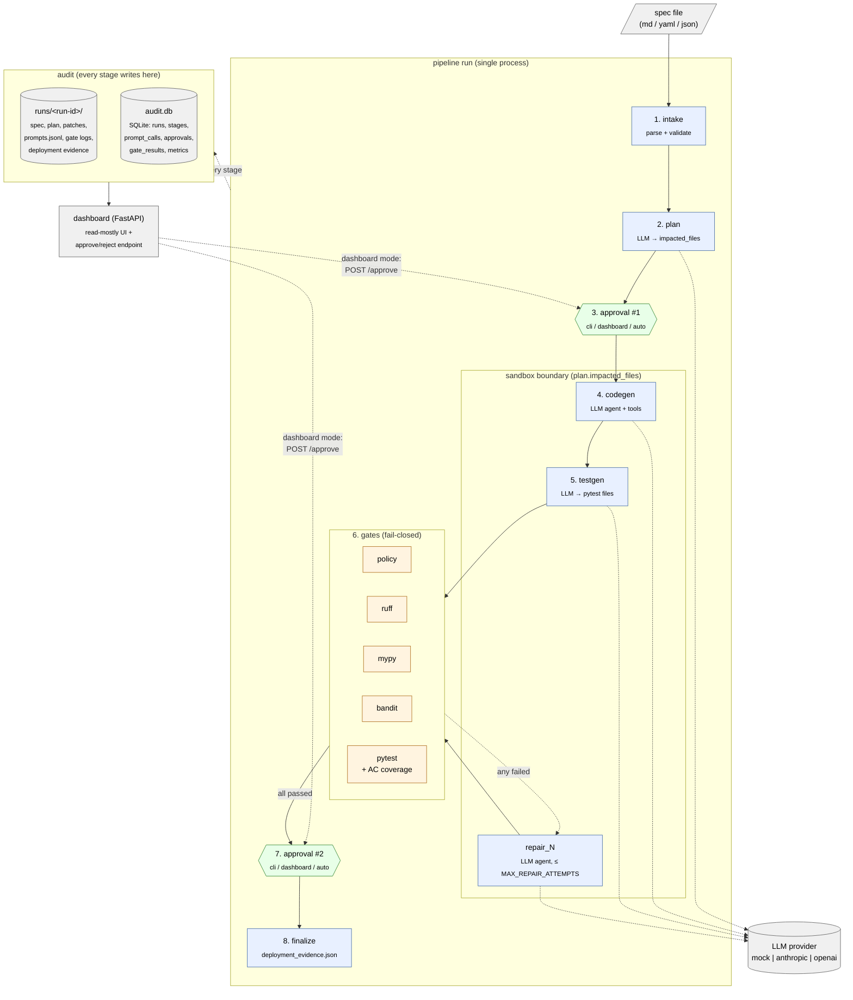
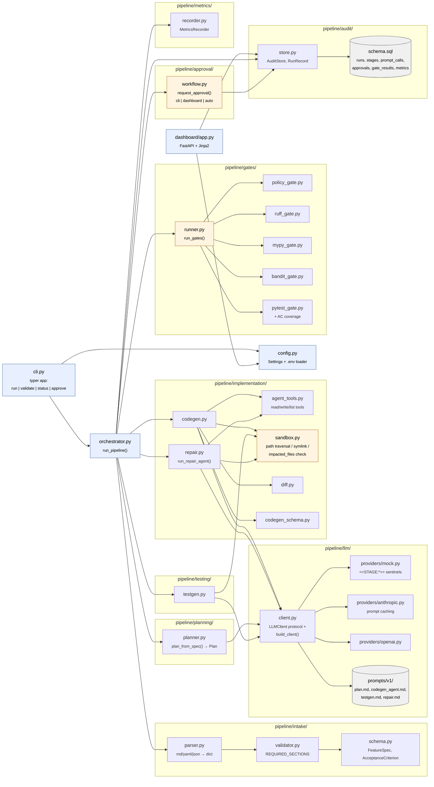
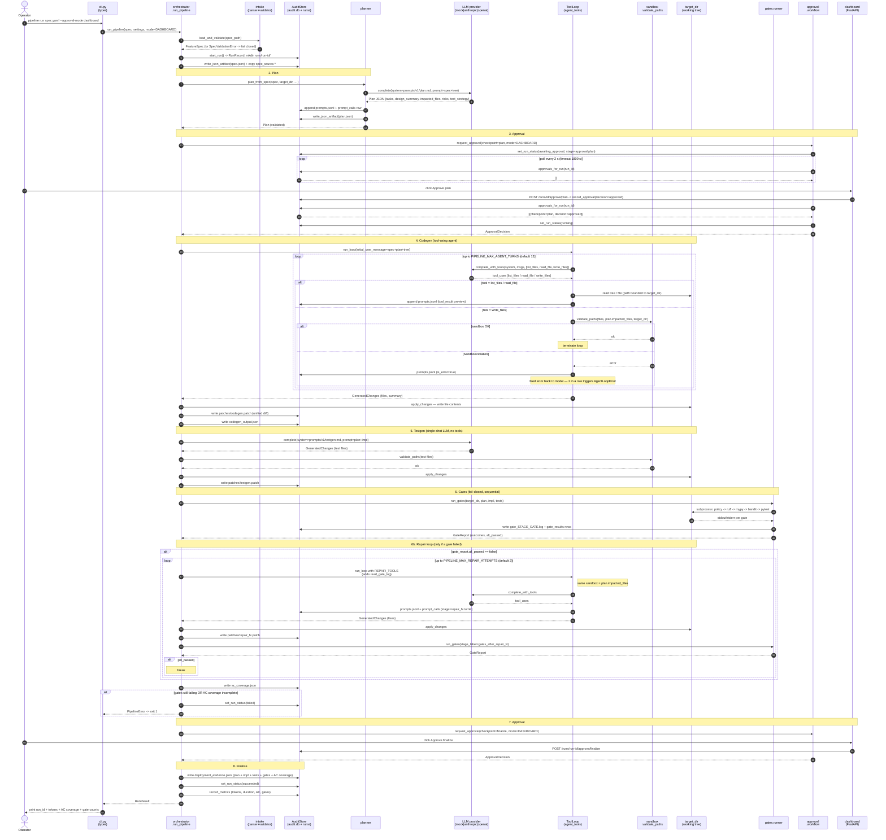

# Architecture diagrams

Two complementary views of the pipeline. The **high-level** chart shows the flow and the governance boundaries — the things every reader needs to understand to reason about a run. The **low-level** chart shows the module decomposition that mirrors the actual package tree, so you know which file owns each box on the high-level chart.

For prose context, see [ARCHITECTURE.md](ARCHITECTURE.md).

---

## High-level architecture

The pipeline is a linear sequence of eight stages, wrapped in two governance boundaries (the **sandbox** around file writes, the **gate suite** around the produced code). The non-deterministic LLM provider sits to the side; the deterministic audit store (filesystem + SQLite) sits below.

**Reading guide:**
- Solid arrows are control flow (stage → stage).
- Dashed arrows are I/O — LLM calls, audit writes, dashboard reads, and the dashboard-driven approval poll.
- The two governance boundaries are the **sandbox** (file paths must be in `plan.impacted_files`) and the **gate suite** (lint/types/tests/security/policy must all pass).
- The repair branch only fires when the gate suite has a failure; gates re-run after each repair attempt.

---

## Low-level architecture

Module-level view. The orchestrator at the centre calls into each package; each package's main file is shown. Subgraph boundaries match the `pipeline/` directory tree.

**Reading guide:**
- `cli.py` and `dashboard/app.py` are the two entry points; both load `config.py` `Settings` and operate on `AuditStore`.
- `orchestrator.py` is the only module that calls every stage; treat it as the index into the rest of the package.
- The **sandbox** module is reused by codegen, testgen *and* repair — that is what makes "the repair agent shares the planner-approved sandbox" true in code, not just doctrine.
- `LLMClient` is one protocol with three implementations; the mock dispatches on `<<STAGE:*>>` sentinels in the prompt template so CI can run end-to-end without API keys.
- The audit store is the single index over both the SQLite tables and the per-run filesystem directory — the dashboard reads exclusively through it.

---

## Sequence diagram — one run, dashboard approval mode

This is the temporal view of a single `pipeline run spec.yaml --approval-mode dashboard` invocation. Every arrow corresponds to a real call in `pipeline/orchestrator.py` (and the modules it calls). `cli` mode replaces the dashboard-polling block with a blocking `input()` on stdin; `auto` mode skips it entirely and records `approver=auto`.

**Notes that the diagram compresses:**
- Every LLM round-trip writes both to `runs/<run-id>/prompts.jsonl` (full transcript) and `audit.db` `prompt_calls` (indexable summary). For the agent loop, each turn becomes its own `prompt_calls` row (`stage="codegen.turn3"`, etc.) — see `agent_tools.ToolLoop._persist_turn`.
- The `cli` mode replaces steps 14–19 with a single `input()` on stdin; the `auto` mode replaces them with one `record_approval(approver="auto")` call and no waiting.
- Sandbox violations during `write_files` are returned to the model as a `tool_result` error so it can retry — only **two consecutive** sandbox errors abort the stage. See `ToolLoop.run_loop` (`consecutive_sandbox_errors`).
- All stage timings are persisted in `audit.db` `stages` rows; the orchestrator's `_stage()` helper wraps every block in start/finish calls so even failures get a duration.

---

## Data-flow diagram

What enters, what changes, what is produced. Boxes with rounded corners are processes; square/cylindrical boxes are data stores; the dashed perimeter is the run's audit footprint.

```mermaid
flowchart LR
    %% --- Inputs ---
    SpecFile[/"spec.{md,yaml,json}<br/>name, objective, user_story,<br/>business_rules, acceptance_criteria,<br/>non_functional, out_of_scope"/]
    TargetIn[("target_dir/<br/>(existing working tree)")]
    EnvFile[/".env<br/>provider, models,<br/>budgets, paths"/]

    %% --- Processes (rounded) ---
    Parse(["parser.parse_spec_file<br/>→ dict"])
    Validate(["validator.validate_spec<br/>→ FeatureSpec<br/>(min_length=1 on all lists)"])
    PlanGen(["planner.plan_from_spec<br/>LLM call (single shot)"])
    Approve1{{"approval.request_approval<br/>checkpoint=plan"}}
    CodegenAgent(["codegen.generate_code<br/>+ ToolLoop (multi-turn)"])
    SandboxCheck{{"sandbox.validate_paths<br/>vs plan.impacted_files"}}
    ApplyCode(["diff.apply_changes<br/>kind=codegen"])
    TestgenStage(["testgen.generate_tests<br/>LLM call (single shot)"])
    ApplyTests(["diff.apply_changes<br/>kind=testgen"])
    GatesRun(["gates.runner.run_gates<br/>5 subprocesses"])
    RepairAgent(["repair.run_repair_agent<br/>+ ToolLoop<br/>(repair_1 … repair_N)"])
    ApplyRepair(["diff.apply_changes<br/>kind=repair_N"])
    ACCalc(["pytest_gate.compute_ac_coverage<br/>parse 'AC: AC-N' markers"])
    Approve2{{"approval.request_approval<br/>checkpoint=finalize"}}
    Finalize(["orchestrator._finalize<br/>(bundle assembly)"])

    %% --- Intermediate data shapes (in-memory) ---
    SpecObj[["FeatureSpec<br/>+ content_hash()"]]
    PlanObj[["Plan<br/>{tasks, design_summary,<br/>impacted_files, risks, test_strategy}"]]
    Changes1[["GeneratedChanges<br/>{files[path, action, content],<br/>summary}"]]
    Changes2[["GeneratedChanges<br/>(tests)"]]
    GateObj[["GateReport<br/>{outcomes[name, passed,<br/>duration, summary], all_passed}"]]
    Fixes[["GeneratedChanges<br/>(repair fixes)"]]

    %% --- Run audit footprint (filesystem) ---
    subgraph RUN_FS["runs/&lt;run-id&gt;/ (per-run filesystem)"]
        direction TB
        ASpec[/"spec.json<br/>spec_source.{md,yaml,json}"/]
        APlan[/"plan.json"/]
        APromptsJ[/"prompts.jsonl<br/>(every LLM turn + tool_result)"/]
        APatches[/"patches/<br/>codegen.patch<br/>testgen.patch<br/>repair_N.patch"/]
        ACodeOut[/"codegen_output.json<br/>(turns, tool_calls, files)"/]
        AGateLogs[/"gate_gates_{ruff,mypy,pytest,<br/>bandit,policy}.log<br/>+ gates.json<br/>(+ gate_gates_after_repair_N_*.log)"/]
        AACov[/"ac_coverage.json"/]
        AEvidence[/"deployment_evidence.json"/]
    end

    %% --- Run audit footprint (SQLite) ---
    subgraph RUN_DB["audit.db (SQLite tables)"]
        direction TB
        TRuns[("runs<br/>spec_hash, provider, model,<br/>prompt_version, current_stage, status")]
        TStages[("stages<br/>name, status, duration_ms")]
        TPrompts[("prompt_calls<br/>stage, tokens, latency, artifact")]
        TApprovals[("approvals<br/>checkpoint, decision, approver")]
        TGateRes[("gate_results<br/>gate, status, summary, artifact")]
        TMetrics[("metrics<br/>tokens, duration, ac, gates")]
    end

    %% --- External providers ---
    LLMSvc[("LLM provider<br/>mock | anthropic | openai")]

    %% --- Output: mutated target ---
    TargetOut[("target_dir/<br/>(mutated in place)<br/>+ new files,<br/>+ tests/test_*.py")]

    %% --- Edges ---
    SpecFile --> Parse --> Validate --> SpecObj
    EnvFile -.-> PlanGen
    EnvFile -.-> CodegenAgent
    EnvFile -.-> TestgenStage
    SpecObj --> PlanGen
    TargetIn -. snapshot tree .-> PlanGen
    PlanGen <-.-> LLMSvc
    PlanGen --> PlanObj
    PlanObj --> Approve1

    Approve1 --> CodegenAgent
    SpecObj --> CodegenAgent
    PlanObj --> CodegenAgent
    TargetIn -. read tools .-> CodegenAgent
    CodegenAgent <-.-> LLMSvc
    CodegenAgent --> Changes1 --> SandboxCheck
    PlanObj -. impacted_files .-> SandboxCheck
    SandboxCheck -->|ok| ApplyCode
    SandboxCheck -.->|violation| CodegenAgent

    PlanObj --> TestgenStage
    Changes1 --> TestgenStage
    TestgenStage <-.-> LLMSvc
    TestgenStage --> Changes2 --> ApplyTests
    PlanObj -. impacted_files .-> ApplyTests

    ApplyCode --> TargetOut
    ApplyTests --> TargetOut
    ApplyCode --> APatches
    ApplyTests --> APatches

    TargetOut --> GatesRun
    GatesRun --> GateObj
    GatesRun --> AGateLogs

    GateObj -. all_passed=false .-> RepairAgent
    PlanObj --> RepairAgent
    AGateLogs -. read_gate_log tool .-> RepairAgent
    RepairAgent <-.-> LLMSvc
    RepairAgent --> Fixes --> ApplyRepair
    ApplyRepair --> TargetOut
    ApplyRepair --> APatches
    ApplyRepair -. trigger .-> GatesRun

    TargetOut --> ACCalc --> AACov
    GateObj --> Approve2
    AACov --> Approve2
    Approve2 --> Finalize
    PlanObj --> Finalize
    Changes1 --> Finalize
    Changes2 --> Finalize
    GateObj --> Finalize
    Finalize --> AEvidence

    %% Audit fan-out (dashed = every stage writes here)
    Validate -.-> ASpec
    Validate -.-> TRuns
    PlanGen -.-> APlan
    PlanGen -.-> APromptsJ
    PlanGen -.-> TPrompts
    Approve1 -.-> TApprovals
    CodegenAgent -.-> APromptsJ
    CodegenAgent -.-> TPrompts
    CodegenAgent -.-> ACodeOut
    TestgenStage -.-> APromptsJ
    TestgenStage -.-> TPrompts
    GatesRun -.-> TGateRes
    RepairAgent -.-> APromptsJ
    RepairAgent -.-> TPrompts
    Approve2 -.-> TApprovals
    Finalize -.-> TMetrics

    %% Every stage writes a stages row
    PlanGen -.-> TStages
    CodegenAgent -.-> TStages
    TestgenStage -.-> TStages
    GatesRun -.-> TStages
    RepairAgent -.-> TStages
    Finalize -.-> TStages

    classDef proc fill:#e8f0ff,stroke:#4a6fa5,color:#000
    classDef gov fill:#fff4e0,stroke:#b07020,color:#000
    classDef artifact fill:#f5f5f5,stroke:#888,color:#000
    classDef ext fill:#fce8e8,stroke:#a04040,color:#000
    classDef inmem fill:#e8ffe8,stroke:#3a8a3a,color:#000
    class Parse,Validate,PlanGen,CodegenAgent,TestgenStage,GatesRun,RepairAgent,ACCalc,Finalize,ApplyCode,ApplyTests,ApplyRepair proc
    class SandboxCheck,Approve1,Approve2 gov
    class SpecFile,EnvFile,TargetIn,TargetOut,LLMSvc ext
    class SpecObj,PlanObj,Changes1,Changes2,GateObj,Fixes inmem
    class ASpec,APlan,APromptsJ,APatches,ACodeOut,AGateLogs,AACov,AEvidence,TRuns,TStages,TPrompts,TApprovals,TGateRes,TMetrics artifact
```

**What this view makes visible that the high/low-level diagrams hide:**

1. **The plan is the contract.** `plan.impacted_files` feeds *three* sandbox checks (codegen, testgen, repair). One human approval at checkpoint #1 governs every subsequent disk write.
2. **The audit footprint is two-sided.** Heavy payloads (full prompt transcripts, gate logs, patches, the evidence bundle) live on the filesystem under `runs/<run-id>/`; SQLite holds indexable metadata only. Both are written from inside each stage — the audit fan-out is not a separate "logging" stage.
3. **The repair branch is a true loop in the data-flow sense.** Gate logs flow *back into* the LLM via the `read_gate_log` tool, repair output goes back through the same sandbox, and gates are re-run on the mutated target — all bounded by `PIPELINE_MAX_REPAIR_ATTEMPTS` so the loop must terminate.
4. **Reproducibility inputs.** A run is fully replayable from `spec.json` + `runs` row (`spec_hash`, `provider`, `model`, `prompt_version`) + `prompts.jsonl`. Everything else is a deterministic function of those.
